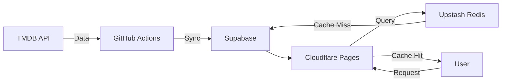

# Free Movie Suggestion

A free-tier-optimized movie suggestion platform built with Astro, React, and Supabase. This tool automatically ingests movie data from TMDB and provides a fast, searchable interface for discovering new movies.

## 🚀 Tool Purpose
The goal of this project is to provide a high-performance, visually appealing movie suggestion site that stays entirely within the free tiers of modern cloud services. It features:
- Automated daily synchronization with TMDB.
- Advanced search and filtering (Postgres Full-Text Search).
- Multi-region support (Hollywood, Bollywood, Tollywood).
- High-performance caching for global speed.

## 🛠 Tech Stack
- **Framework:** [Astro](https://astro.build/) (SSR Mode)
- **Frontend:** [React](https://reactjs.org/) + [Tailwind CSS v4](https://tailwindcss.com/)
- **Animations:** [Framer Motion](https://www.framer.com/motion/), [GSAP](https://greensock.com/gsap/)
- **Database:** [Supabase](https://supabase.com/) (PostgreSQL)
- **Cache:** [Upstash Redis](https://upstash.com/)
- **Deployment:** [Cloudflare Pages](https://pages.cloudflare.com/)
- **Data Source:** [TMDB API](https://www.themoviedb.org/documentation/api)

## 🏗 Architecture
The project follows a "Sync-Store-Serve" architecture:
1. **Sync (Background):** A TypeScript script runs daily via GitHub Actions. It fetches movie details from TMDB and upserts them into Supabase.
2. **Store (Data):** Supabase acts as the primary source of truth, storing movie metadata, cast, and genres.
3. **Serve (Edge):** Astro server endpoints handle requests. They first check Upstash Redis for a cached response. If not found, they query Supabase and cache the result.



##  Genie Commands

All commands are run from the root of the project:

| Command                   | Action                                           |
| :------------------------ | :----------------------------------------------- |
| `npm install`             | Installs dependencies                            |
| `npm run dev`             | Starts local dev server at `localhost:4321`      |
| `npm run build`           | Build your production site to `./dist/`          |
| `npm run preview`         | Preview your build locally, before deploying     |
| `npm run sync`            | Manually trigger movie data synchronization      |
| `npm run sync -- 1000`    | Sync a specific number of movies (e.g., 1000)    |

## 🤝 Contribution

1. **Clone the repo:**
   ```sh
   git clone https://github.com/your-username/freemoviesuggestion.git
   ```

2. **Set up Environment Variables:**
   Create a `.env` file based on `.env.example`:
   - `PUBLIC_SUPABASE_URL`
   - `PUBLIC_SUPABASE_ANON_KEY`
   - `SUPABASE_SERVICE_ROLE_KEY`
   - `TMDB_ACCESS_TOKEN`
   - `UPSTASH_REDIS_REST_URL`
   - `UPSTASH_REDIS_REST_TOKEN`

3. **Install & Run:**
   ```sh
   npm install
   npm run dev
   ```

4. **Sync Data:**
   Run `npm run sync` to populate your local Supabase instance with movies.

## 🧞 Project Structure

```text
/
├── .github/workflows/ # GitHub Actions (Sync)
├── public/            # Static assets
├── scripts/           # Maintenance & Sync scripts
├── src/
│   ├── components/    # UI Components (Astro & React)
│   ├── data/          # Static data & configurations
│   ├── lib/           # Core library wrappers (Supabase, Redis)
│   ├── pages/         # Route handlers & UI pages
│   ├── services/      # Business logic (TMDB, Cache, Sync)
│   └── styles/        # Global CSS (Tailwind)
└── package.json
```
