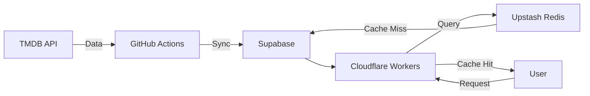

# Free Movie Suggestion

<p align="center">
  <a href="https://astro.build"></a>
  <a href="https://reactjs.org"></a>
  <a href="https://www.typescriptlang.org"></a>
  <a href="https://supabase.com"></a>
  <a href="https://upstash.com"></a>
  <a href="https://workers.cloudflare.com"></a>
  <a href="https://www.themoviedb.org"></a>
  <a href="https://github.com/mdsarfarazalam840/freemoviesuggestion/actions"></a>
  <a href="https://github.com/mdsarfarazalam840/freemoviesuggestion"></a>
</p>

A free-tier-optimized movie suggestion platform built with Astro, React, and Supabase. This tool automatically ingests movie data from TMDB and provides a fast, searchable interface for discovering new movies.


## 📋 Table of Contents

- [Tool Purpose](#-tool-purpose)
- [Tech Stack](#-tech-stack)
- [Architecture](#-architecture)
- [Prerequisites](#-prerequisites)
- [Genie Commands](#-genie-commands)
- [Deployment](#-deployment)
- [Project Structure](#-project-structure)
- [Contributing](#-contributing)
- [License](#-license)

## 🚀 Tool Purpose
The goal of this project is to provide a high-performance, visually appealing movie suggestion site that stays entirely within the free tiers of modern cloud services. It features:
- Automated daily synchronization with TMDB.
- Advanced search and filtering (Postgres Full-Text Search).
- Multi-region support (Hollywood, Bollywood, Tollywood).
- High-performance caching for global speed.

## 🛠 Tech Stack
- **Framework:** [Astro](https://astro.build/) (SSR Mode)
- **Frontend:** [React](https://reactjs.org/) + [Tailwind CSS v4](https://tailwindcss.com/)
- **Animations:** [Framer Motion](https://www.framer.com/motion/), [GSAP](https://greensock.com/gsap/)
- **Database:** [Supabase](https://supabase.com/) (PostgreSQL)
- **Cache:** [Upstash Redis](https://upstash.com/)
- **Deployment:** [Cloudflare Workers](https://workers.cloudflare.com/)
- **Data Source:** [TMDB API](https://www.themoviedb.org/documentation/api)

## 🏗 Architecture
The project follows a "Sync-Store-Serve" architecture:
1. **Sync (Background):** A TypeScript script runs daily via GitHub Actions. It fetches movie details from TMDB and upserts them into Supabase.
2. **Store (Data):** Supabase acts as the primary source of truth, storing movie metadata, cast, and genres.
3. **Serve (Edge):** Astro server endpoints handle requests. They first check Upstash Redis for a cached response. If not found, they query Supabase and cache the result.



## ✅ Prerequisites

Before running any commands, ensure you have the following installed:

- **Node.js** >= 22.12.0
- **npm** (ships with Node.js)
- **Wrangler CLI** — installed as a dev dependency (`npx wrangler`)

You'll also need API keys for the following services (see [Environment Setup](#-contribution)):

| Service       | Required For            |
| :------------ | :---------------------- |
| Supabase      | Database & Auth         |
| TMDB          | Movie data ingestion    |
| Upstash Redis | Caching layer           |
| Cloudflare    | Workers deployment      |

##  Genie Commands

All commands are run from the root of the project:

| Command                   | Action                                           |
| :------------------------ | :----------------------------------------------- |
| `npm install`             | Installs dependencies                            |
| `npm run dev`             | Starts local dev server at `localhost:4321`      |
| `npm run build`           | Build your production site to `./dist/`          |
| `npm run preview`         | Preview your build locally, before deploying     |
| `npm run sync`            | Manually trigger movie data synchronization      |
| `npm run sync -- 1000`    | Sync a specific number of movies (e.g., 1000)    |

## 🚀 Deployment

The project has two deployable components deployed on **Cloudflare Workers**: the **sync worker** (TMDB data ingestion) and the **website** (Astro SSR).

### Sync Worker (TMDB Data Ingestion)

A dedicated Cloudflare Worker (separate from the website) runs daily via Cron Triggers to fetch fresh movie data from TMDB and upsert it into Supabase.

```sh
# Deploy the sync worker
npx wrangler deploy --config workers/wrangler.toml --name movie-sync-worker workers/index.ts

# Tail live sync worker logs
npx wrangler tail --name movie-sync-worker
```

> The worker is already configured with a `cron` trigger (`0 0 * * *`) in [`workers/wrangler.toml`](./workers/wrangler.toml) so it runs automatically every day at midnight UTC after deployment.

### Website (Astro + Cloudflare Workers)

The Astro site uses the `@astrojs/cloudflare` adapter to output an SSR-ready build deployed as a Cloudflare Worker.

```sh
# Build the Astro site
npm run build

# Deploy the website Worker (requires root wrangler.toml with name "movie-sync-worker")
npx wrangler deploy --config wrangler.toml --name movie-sync-worker
```

> For production, connect your GitHub repository to Cloudflare via automatic CI/CD deployments on every push to `main`.

## 🤝 Contribution

1. **Clone the repo:**
   ```sh
   git clone https://github.com/your-username/freemoviesuggestion.git
   ```

2. **Set up Environment Variables:**
   Create a `.env` file based on `.env.example`:
   - `PUBLIC_SUPABASE_URL`
   - `PUBLIC_SUPABASE_ANON_KEY`
   - `SUPABASE_SERVICE_ROLE_KEY`
   - `TMDB_ACCESS_TOKEN`
   - `UPSTASH_REDIS_REST_URL`
   - `UPSTASH_REDIS_REST_TOKEN`

3. **Install & Run:**
   ```sh
   npm install
   npm run dev
   ```

4. **Sync Data:**
   Run `npm run sync` to populate your local Supabase instance with movies.

## 🧞 Project Structure

```text
/
├── .github/workflows/ # GitHub Actions (Sync)
├── public/            # Static assets
├── scripts/           # Maintenance & Sync scripts
├── src/
│   ├── components/    # UI Components (Astro & React)
│   ├── data/          # Static data & configurations
│   ├── lib/           # Core library wrappers (Supabase, Redis)
│   ├── pages/         # Route handlers & UI pages
│   ├── services/      # Business logic (TMDB, Cache, Sync)
│   └── styles/        # Global CSS (Tailwind)
└── package.json
```

## 📄 License

This project is open source and available under the [MIT License](LICENSE).
